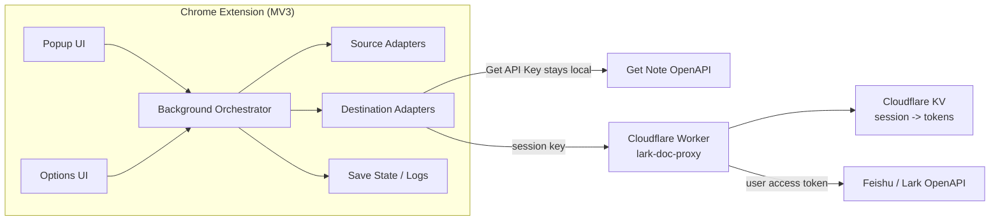
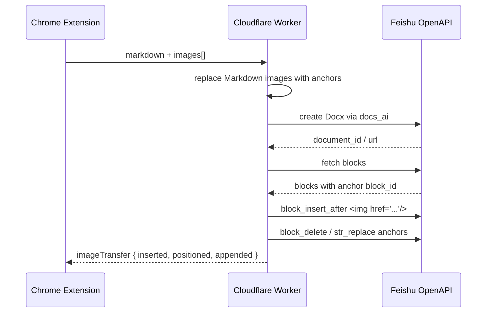

# Zylos 网页 / 飞书 / Get 保存插件架构设计

> 对应飞书文档：[Zylos 网页 / 飞书 / Get 保存插件架构设计](https://zvrtjlmg40.feishu.cn/docx/BDMzdQ0YZozMfwxqWeccFiBMnDd)
>
> 功能实现基线：`c74982c35a24c6b668283157262e9e048b6e2f92`

## 结论

Zylos 这版系统已经形成清晰的三层架构：

- **Chrome 插件**负责识别页面、抽取当前内容、本地配置和用户交互。
- **Cloudflare Worker**负责飞书 OAuth、token 存储与飞书 API 代理。
- **外部目标系统**分别承接最终保存结果：Get 笔记保存笔记，飞书文档保存 Docx。

最新能力包括：公众号正文保存到飞书文档、图片转存为飞书原生图片块、图片优先插入到原文对应位置、重复保存去重、飞书旧链接失效后自动重新保存，以及批量保存当前窗口网页到 Get。

## 1. 这套系统解决什么问题

Zylos 这套插件的目标很朴素：用户正在浏览飞书文档、普通网页或微信公众号文章时，不需要复制粘贴，也不需要手工整理格式，只点一次浏览器插件，就能把内容保存到 Get 笔记、飞书文档，或两边都保存。

| 用户侧看到的能力 | 系统侧承担的复杂性 |
| --- | --- |
| 保存到 Get 笔记：普通网页优先保存链接，失败后使用正文兜底。 | 飞书 OAuth 登录和 token 刷新。 |
| 保存为飞书文档：网页或公众号正文转成 Docx。 | 飞书文档 blocks 拉取、wiki token 转 docx token。 |
| 飞书 + Get 都保存：一次操作同时写两个目标。 | 网页与公众号正文抽取。 |
| 批量保存当前窗口网页到 Get。 | 第三方图片外链清理、转存和插入位置控制。 |
| 重复保存时提示已保存过，并允许仍然再次保存。 | Get API 限流、失败重试和日志可视化。 |

## 2. 总体架构示意图

系统核心分工是：**浏览器插件处理用户现场和本地配置，Worker 只代理飞书侧敏感能力，Get API Key 始终留在用户浏览器本机。**

```text
┌─────────────────────────────────────────────────────────────┐
│ Chrome Extension (MV3)                                      │
│                                                             │
│  Popup UI         Options UI          Background Orchestrator│
│  - 识别当前页      - Worker URL       - 路由 source/destination│
│  - 保存按钮        - 飞书登录          - 去重、日志、错误聚合      │
│  - 结果反馈        - Get API Key       - 批量保存                │
└───────────────┬───────────────────────┬─────────────────────┘
                │                       │
                │ Get API Key 留本机     │ Feishu session key
                ▼                       ▼
┌─────────────────────────┐   ┌────────────────────────────────┐
│ Get Note OpenAPI         │   │ Cloudflare Worker               │
│ - link note              │   │ lark-doc-proxy                  │
│ - plain_text fallback    │   │ - OAuth start/callback          │
│ - rate limit handling    │   │ - KV session/token storage      │
└─────────────────────────┘   │ - Feishu doc read/create/update │
                              │ - article extractor proxy       │
                              └───────────────┬────────────────┘
                                              │ User access token
                                              ▼
                              ┌────────────────────────────────┐
                              │ Feishu / Lark OpenAPI           │
                              │ - docx blocks read              │
                              │ - docs_ai document create/update│
                              │ - wiki node resolve             │
                              └────────────────────────────────┘
```



| 层级 | 主要职责 | 为什么这样放 |
| --- | --- | --- |
| Chrome 插件 | 识别当前页面、注入 DOM 抽取脚本、保存 Get Key、展示按钮和结果。 | 它最靠近用户现场，能拿到当前 Tab、页面 DOM 和浏览器本地存储。 |
| Background Orchestrator | 把来源 Source 和目标 Destination 组合起来，处理去重、批量、日志和错误聚合。 | 避免 Popup 直接承担业务复杂度，保持 UI 简单。 |
| Cloudflare Worker | 飞书 OAuth、token 刷新、飞书文档读写代理、图片插入编排。 | 飞书 app_secret 不能放在浏览器；Worker 是轻量、安全的后端边界。 |
| 飞书 OpenAPI | 文档读取、创建、更新、图片块插入。 | 最终文档必须由飞书 API 生成，才能得到原生 Docx 能力。 |
| Get Note OpenAPI | 创建链接笔记或正文笔记。 | Get Key 属于用户个人凭证，直接由插件本地调用更安全。 |

## 3. 核心运行链路

### 3.1 普通网页 / 公众号 → 飞书文档

```text
用户点击「保存为飞书文档」
  ↓
Popup 发送 save 消息给 Background
  ↓
Background 根据 URL 判断 sourceType
  ↓
Article Source Adapter 从当前 Tab DOM 抽取标题、正文、作者、发布时间、图片 URL
  ↓
Feishu Destination 把标准化内容 POST 给 Worker
  ↓
Worker 用用户 session 换 access token
  ↓
Worker 调 docs_ai 创建飞书 Docx
  ↓
Worker 用临时图片锚点定位正文中的图片位置
  ↓
Worker 插入飞书原生图片块并清理锚点
  ↓
Popup 展示文档链接和图片插入统计
```

### 3.2 飞书文档 → Get 笔记

```text
用户打开飞书文档并点击「保存到 Get 笔记」
  ↓
Background 请求 Worker /api/doc
  ↓
Worker 识别 docx 或 wiki 链接，必要时把 wiki token 转成 docx token
  ↓
Worker 分页拉取 docx blocks
  ↓
插件侧 blocksToMarkdown 转换为 Markdown
  ↓
Get Destination 清理图片外链并调用 Get OpenAPI
  ↓
保存成功后写入本地保存历史和日志
```

### 3.3 普通网页 / 公众号 → Get 笔记

| 步骤 | 策略 | 原因 |
| --- | --- | --- |
| 1. 内容识别 | 优先从当前 Tab DOM 抽取。 | 当前页面已经在用户浏览器里打开，最接近真实可见内容。 |
| 2. Get 写入 | 普通网页优先保存为 link note。 | 让 Get 自己抓网页，避免正文里第三方图片外链导致解析失败。 |
| 3. 兜底 | link 失败后改为 plain_text，并清理图片语法和裸图片 URL。 | 保住正文保存成功率。 |
| 4. 限流 | 插件侧做基础节流和重试。 | Get API 存在低频率限制，批量保存需要温和推进。 |

## 4. 模块职责拆解

| 模块 | 位置 | 职责 | 设计重点 |
| --- | --- | --- | --- |
| Popup UI | `extension/popup.js` | 展示当前页面类型、保存按钮、批量按钮、保存结果。 | 用户只看到少量清晰动作，不暴露内部链路。 |
| Options UI | `extension/options.js` | 配置 Worker URL、飞书登录、Get API Key、查看日志。 | 把运行时配置和诊断放到一个地方。 |
| Auth Manager | `extension/lib/auth-manager.js` | 管理飞书 OAuth session 和插件本地配置。 | 前端只保存 session key，不保存飞书 access token。 |
| Source Adapters | `extension/lib/source/*` | 把飞书文档、网页文章、公众号文章统一转成 NormalizedContent。 | 上游来源不同，但下游只面对统一内容结构。 |
| Destination Adapters | `extension/lib/destination/*` | 把标准化内容写入 Get 或飞书文档。 | 目标系统的 API 差异被隔离在适配器里。 |
| Save State | `extension/lib/save-state.js` | 保存历史、重复保存判断、失败日志。 | 去重是体验优化，不影响真实保存链路。 |
| Worker | `worker/src/index.js` | 飞书 OAuth、session KV、文档读取、文档创建、图片插入。 | 集中处理飞书敏感能力，不碰 Get API Key。 |

## 5. 数据模型：NormalizedContent

系统内部用一个统一内容对象衔接 source 和 destination。这样新增来源或目标时，不需要把所有路径重新写一遍。

```json
{
  "sourceType": "wechat-article | web-article | feishu-doc",
  "sourceUrl": "原始页面 URL",
  "title": "标题",
  "author": "作者，可为空",
  "publishedAt": "发布时间，可为空",
  "markdown": "正文 Markdown",
  "images": [
    {
      "src": "图片 URL",
      "alt": "图片说明",
      "kind": "inline"
    }
  ],
  "metadata": {
    "extraction": "dom",
    "extractor": "wechat-dom"
  }
}
```

> Markdown 在这个系统里不是最终产品，而是中间交换格式。用户最终看到的是 Get 笔记或飞书 Docx，Markdown 只是让不同来源和不同目标之间有一个轻量的共同语言。

## 6. 图片转存设计

图片是这套系统里最容易出问题的部分：Get 会拒绝部分第三方图片外链；微信公众号图片常藏在 `data-src`；飞书文档希望得到原生图片块，而不是一串外链文本。

```text
1. 插件从 DOM 抽取正文 Markdown 和图片列表
2. Worker 创建飞书文档前，把 Markdown 图片语法替换为临时锚点
   例：ZylosImageAnchor:3:hash
3. Worker 调 docs_ai 创建 Docx
4. Worker 读取新文档 blocks，找到这些锚点所在 block_id
5. Worker 在锚点后插入 
6. Worker 删除锚点 block 或用 str_replace 清理锚点文本
7. 如果某些锚点找不到，图片兜底插入文末
```



| 设计点 | 当前策略 | 收益 |
| --- | --- | --- |
| 图片来源 | 公众号优先读取 `data-src`，普通网页读取 `currentSrc/src`。 | 更贴近真实正文图片。 |
| 插入上限 | 最多 20 张。 | 控制文档创建时间、飞书 API 请求数和失败面。 |
| 插入位置 | 优先锚点随文插入，锚点失败时文末兜底。 | 可读性优先，同时保证保存不被图片定位拖垮。 |
| 失败反馈 | Popup 显示 `图片：已插入 x/y，随文 a，文末 b`。 | 用户能直接判断图片是否按预期进入文档。 |

## 7. 安全与权限边界

| 已经明确的安全边界 | 仍需注意的边界 |
| --- | --- |
| Get API Key 只存在用户本机 Chrome storage。 | 第三方图片可能反盗链，飞书从 URL 导入图片会失败。 |
| 飞书 app_secret 只存在 Cloudflare Worker secrets。 | Get API 有低频率限制，批量保存不能过快。 |
| Worker 给前端的只是 session key，不直接暴露飞书 access token。 | 公众号后端抽取服务当前是可选边界，主路径仍依赖当前页面 DOM。 |
| 飞书读写使用用户 OAuth 身份，用户看不到的文档插件也看不到。 | 插件分发时需要用户重新加载未打包扩展或走正式打包发布。 |

### 权限流转

| 凭证 | 保存位置 | 用途 | 不会做什么 |
| --- | --- | --- | --- |
| Get API Key / Client ID | Chrome 本地存储 | 直接调用 Get Note OpenAPI。 | 不会上传给 Worker。 |
| 飞书 app_secret | Cloudflare Worker Secret | OAuth code 换 token、刷新 token。 | 不会进入浏览器插件包。 |
| 飞书 access / refresh token | Cloudflare KV | 代表用户调用飞书文档 API。 | 不会明文返回给前端。 |
| session key | Chrome 本地存储 | 前端向 Worker 证明“我是这个登录会话”。 | 不能单独调用飞书 OpenAPI。 |

## 8. 部署与当前分支状态

| 项目 | 当前状态 |
| --- | --- |
| GitHub 分支 | `codex/v2-content-router` 已同步远端。 |
| 功能实现基线 | `c74982c35a24c6b668283157262e9e048b6e2f92` |
| 基线提交 | `feat: insert article images near source text` |
| Draft PR | <https://github.com/spinliu/feishu-to-getnote/pull/1> |
| Worker URL | <https://lark-doc-proxy.spin-liu.workers.dev> |
| 最新 Worker 版本 | `68e3c653-d26e-4c7f-a920-58c366b3b417` |

> Worker 已经在线生效；但 Chrome 插件端有 popup 文案和前端抽取逻辑改动，因此本机扩展仍需要在 `chrome://extensions` 点一次“重新加载”。如果测试同一篇文章，需要点“仍然再次保存”，否则去重会直接返回历史结果。

## 9. 已知边界与下一步

| 优先级 | 事项 | 说明 |
| --- | --- | --- |
| P1 | 图片下载后上传 | 当前飞书图片块使用 URL 导入；若遇到强反盗链，需要 Worker 下载图片并上传为飞书素材。 |
| P1 | 批量保存飞书文档 | 当前批量只走 Get 链接笔记；批量正文抽取和批量飞书保存可作为后续增强。 |
| P1 | 失败日志可视化增强 | 设置页已有日志，后续可增加过滤、复制诊断、按来源聚合。 |
| P2 | 飞书目标文件夹配置 | 目前创建位置依赖默认空间或 Worker 环境变量；后续可在插件设置中选择目标文件夹。 |
| P2 | 打开结果动作 | 保存成功后可以增加“打开飞书文档”“复制链接”等快捷按钮。 |

## 10. 架构判断小结

这套架构目前最重要的优点是边界清楚：浏览器负责现场内容和用户体验，Worker 负责飞书安全代理，Get 凭证不出本机。后续新增更多内容来源或保存目标时，优先扩展 Source Adapter 和 Destination Adapter，而不是把逻辑继续堆进 Popup。
